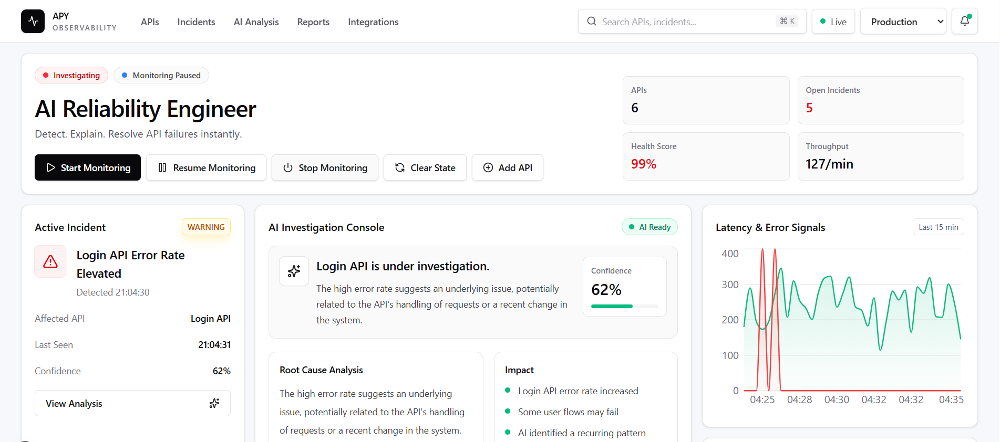
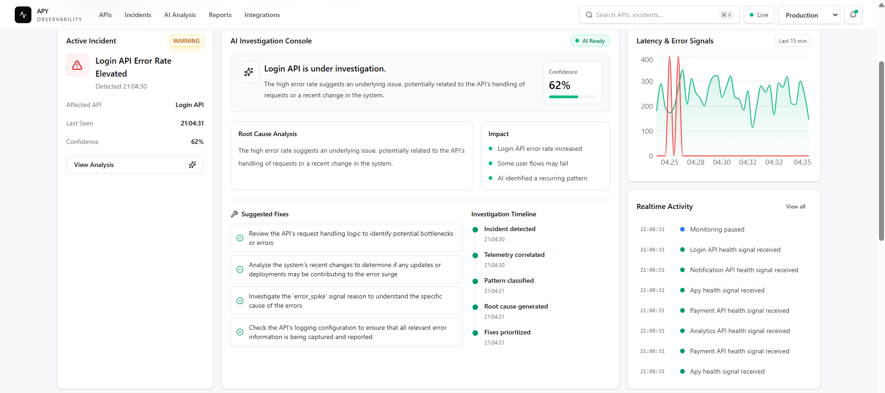
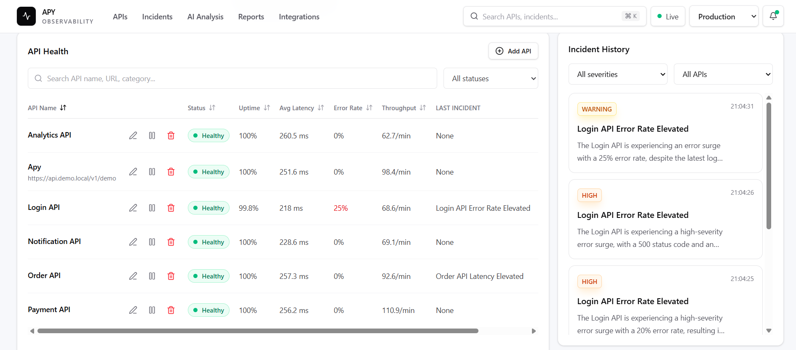
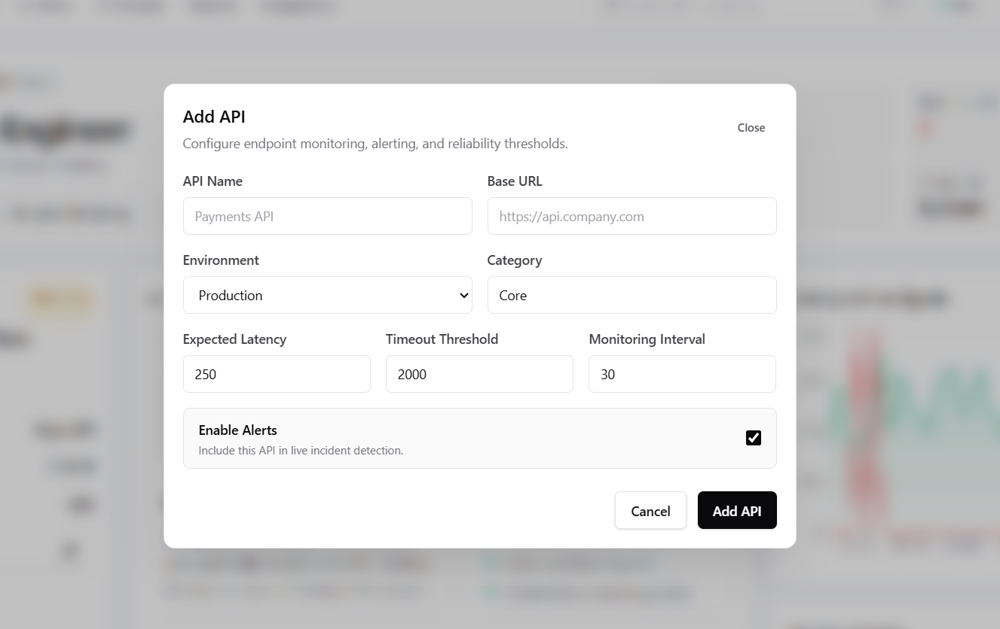

# APY

APY is a local AI reliability playground for monitoring demo APIs, detecting incidents, and generating concise investigation notes.

The core demo flow is:

```text
Start monitoring -> API signals stream in -> incidents are detected -> AI explains impact and next steps
```

The app runs with a FastAPI backend, SQLite database, WebSockets, a live traffic simulator, Groq-powered analysis, and a Next.js frontend.

AI functionality uses Groq only through `from groq import Groq` with `llama-3.3-70b-versatile`.

Repository: [anchalverma792/PLUSE](https://github.com/anchalverma792/PLUSE)

## Live Deployment

- Website: [https://apy-frontend-production.up.railway.app](https://apy-frontend-production.up.railway.app)
- Backend API: [https://apy-backend-production.up.railway.app](https://apy-backend-production.up.railway.app)

## Screenshots

### Dashboard Overview



### AI Investigation Console



### API Health And Incident History



### Add API Modal



## Features

- APY dashboard with live monitoring controls.
- API health table with add, edit, disable alerts, and remove actions.
- Seeded demo APIs for Payment, Login, Order, Notification, and Analytics.
- Realtime activity stream over WebSockets.
- Active incident panel with severity, affected API, confidence, and timeline.
- AI investigation console with root-cause summary, impact, and suggested fixes.
- Latency and error chart for the last 15 minutes.
- Incident history with severity and API filters.
- Environment filter for production, staging, and development APIs.
- Assistant endpoint for asking questions about current incident/log context.

## Requirements

- Python 3.13 or compatible Python 3 version.
- Node.js and npm.
- A Groq API key for fresh AI incident analysis.

The app still runs without `GROQ_API_KEY`, but fresh Groq analysis and chat responses will be disabled until the key is configured.

## Backend Setup

Run these commands from the project root:

```powershell
cd backend
Copy-Item .env.example .env
python -m venv .venv
.\.venv\Scripts\python.exe -m pip install -r requirements.txt
```

Update `backend/.env`:

```text
GROQ_API_KEY=your_groq_key_here
DATABASE_URL=sqlite:///./pulseroot.db
FRONTEND_ORIGIN=http://localhost:3000
SIMULATOR_ENABLED=true
SIMULATOR_TICK_SECONDS=1.0
```

Start the backend:

```powershell
.\.venv\Scripts\python.exe -m uvicorn app.main:app --reload --host 127.0.0.1 --port 8000
```

Backend URLs:

- API base: [http://localhost:8000](http://localhost:8000)
- Health check: [http://localhost:8000/health](http://localhost:8000/health)
- Swagger docs: [http://localhost:8000/docs](http://localhost:8000/docs)

## Frontend Setup

In a second terminal, run:

```powershell
cd frontend
npm install
npm run dev
```

Open [http://localhost:3000](http://localhost:3000).

PowerShell may block `npm.ps1` on some Windows machines. If that happens, use `npm.cmd`:

```powershell
npm.cmd install
npm.cmd run dev
```

The frontend expects the backend at `http://localhost:8000`. Set `NEXT_PUBLIC_API_BASE` only if the backend is running somewhere else.

## Demo Flow

1. Start the backend on port `8000`.
2. Start the frontend on port `3000`.
3. Open [http://localhost:3000](http://localhost:3000).
4. Click `Start Monitoring`.
5. Watch live activity, API health, charts, incidents, AI analysis, and suggested fixes update.
6. Use `Pause Monitoring`, `Stop Monitoring`, or `Clear State` to control the simulation.

## Add A Demo API

Use the `Add API` button in the APY dashboard. Example values:

```text
API Name: Apy
Base URL: https://api.demo.local/v1/demo
Environment: Production
Category: Demo
Expected Latency: 250
Timeout Threshold: 2000
Monitoring Interval: 30
Enable Alerts: checked
```

After saving, the API appears in the `API Health` table and can participate in live monitoring.

## Backend API

Common endpoints:

```text
GET    /health
GET    /api/summary
GET    /api/apis
POST   /api/apis
PATCH  /api/apis/{api_id}
DELETE /api/apis/{api_id}
GET    /api/logs
GET    /api/incidents
GET    /api/incidents/{incident_id}
GET    /api/charts/traffic
GET    /api/simulation/status
POST   /api/simulation/start
POST   /api/simulation/pause
POST   /api/simulation/resume
POST   /api/simulation/stop
POST   /api/simulation/reset
POST   /api/assistant/chat
WS     /api/ws
```

## Project Structure

```text
backend/
  app/api/routes.py          FastAPI routes
  app/core/config.py         Settings and environment variables
  app/db/session.py          SQLite and SQLAlchemy session setup
  app/models/entities.py     Database models
  app/schemas/dto.py         Request and response schemas
  app/services/              AI, incident, anomaly, testing, and websocket services
  app/simulator/engine.py    Live traffic simulator
  requirements.txt

frontend/
  app/                       Next.js App Router pages
  components/layout/         App shell and navigation
  components/playground/     Main APY dashboard experience
  components/ui/             Shared UI primitives
  context/                   App-level state
  hooks/                     Live stream hook
  lib/                       API client, types, utilities
  package.json
```

## Useful Commands

```powershell
# Frontend checks
cd frontend
npm.cmd run lint
npm.cmd run build

# Stop local servers on the default ports
Get-NetTCPConnection -LocalPort 3000,8000 -State Listen | ForEach-Object { Stop-Process -Id $_.OwningProcess }
```

## Production Deployment

APY is deployment-ready for:

- Frontend: Railway or Vercel
- Backend: Railway
- Production database: Railway PostgreSQL

Deploy the backend first, then set the frontend API URL to the backend's public Railway URL.

### Railway Backend

Deploy from the `backend/` directory. Railway should use:

```text
Start command: uvicorn app.main:app --host 0.0.0.0 --port $PORT
```

Required Railway variables:

```text
DATABASE_URL=<Railway PostgreSQL DATABASE_URL>
GROQ_API_KEY=<your Groq key>
FRONTEND_ORIGIN=https://<your-primary-frontend-domain>
EXTRA_FRONTEND_ORIGINS=https://<optional-additional-frontend-domain>
ALLOW_VERCEL_ORIGINS=true
ALLOW_CLOUDFLARE_TUNNEL_ORIGINS=false
SIMULATOR_ENABLED=true
SIMULATOR_TICK_SECONDS=1.0
```

The backend supports Railway's `postgres://` and `postgresql://` URLs automatically.

### Railway Frontend

Deploy from the `frontend/` directory. Railway should use the included `frontend/railway.json` and Node version from `frontend/.node-version`.

Required Railway variable:

```text
NEXT_PUBLIC_API_BASE=https://<your-railway-backend>.up.railway.app
```

### Vercel Frontend

Deploy from the `frontend/` directory. Set this Vercel environment variable:

```text
NEXT_PUBLIC_API_BASE=https://<your-railway-backend>.up.railway.app
```

The frontend derives WebSocket URLs from `NEXT_PUBLIC_API_BASE`, so an HTTPS backend becomes `wss://.../api/ws` automatically.

### Production Verification

After both deployments are live:

```powershell
Invoke-WebRequest https://<your-railway-backend>.up.railway.app/health
Invoke-WebRequest https://<your-railway-backend>.up.railway.app/api/summary
```

Then open the Vercel URL and verify:

- The header status changes from `Reconnecting` to `Live`.
- `Add API` accepts a custom API name and URL.
- The new API appears in `API Health`.
- `Start Monitoring` streams activity and chart updates.
- Incident analysis and suggested fixes update as events arrive.

## Notes

- SQLite data is stored at `backend/pulseroot.db`.
- The seeded APIs are created automatically on backend startup if they do not already exist.
- `Clear State` removes generated logs, incidents, and synthetic test results, then resets seeded API health values.
- This root `README.md` is the single README for the project.
